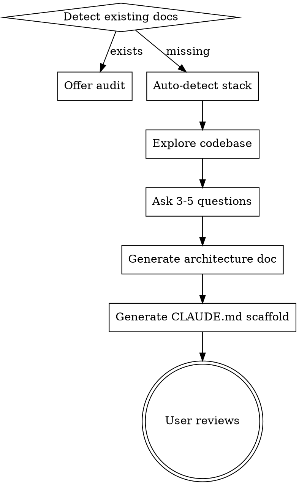

# /map — Codebase Architecture Generator

Generate `docs/codebase-architecture.md` (the map) and `.claude/CLAUDE.md` (the scaffold) for any project.

## Hard Rules

1. **Reference source, don't duplicate it.** Use `file:line` pointers. Only inline a snippet when it's a one-liner with no source location yet.
2. **Tables over prose.** Scannable, dense.
3. **Project vocabulary.** Use the project's own names for layers, patterns, concepts.
4. **ASCII diagrams.** No Mermaid, no images.
5. **Conditional sections.** Include what's relevant, skip what isn't.

## Process



### Step 1: Detect

Check for `docs/codebase-architecture.md` and `.claude/CLAUDE.md`.
- Both exist → offer to **audit** (check stale `file:line` refs, missing files, undocumented additions)
- Missing → proceed to bootstrap

### Step 2: Auto-detect stack

Scan for config files to identify languages, frameworks, build tools, package managers:
- `mix.exs`, `package.json`, `Cargo.toml`, `go.mod`, `pyproject.toml`, `Gemfile`, `pom.xml`, `build.gradle`, `Makefile`, `Dockerfile`, `docker-compose.yml`, etc.
- Extract: project name, dependencies, available scripts/tasks, test commands

### Step 3: Explore codebase

Use subagents to build a complete picture. Discover:
- **Entry points** — where does execution start? (HTTP handlers, CLI commands, event listeners, main functions)
- **Processing layers** — what do requests/commands pass through?
- **State management** — where is state defined, stored, mutated?
- **File inventory** — every source file, grouped by domain concern
- **Communication patterns** — REST, WebSocket, PubSub, IPC, message queues
- **Key types/interfaces** — union types, enums, structs that define the domain

### Step 4: Ask targeted questions

One at a time. Focus on what exploration couldn't answer:
- What is this project? (one sentence)
- What are the 3-5 most common tasks a developer does in this codebase?
- Any key architectural decisions that aren't obvious from the code?
- Any gotchas or landmines you've hit?

### Step 5: Generate architecture doc

Write `docs/codebase-architecture.md` using the section catalog below.

### Step 6: Generate CLAUDE.md scaffold

Write `.claude/CLAUDE.md` using the scaffold spec below.

### Step 7: User reviews and commits

Present both files. User refines. Commit when approved.

---

## Architecture Doc — Section Catalog

### Required: Header

One sentence + key tech + storage/persistence approach.

### Required: Commands

Build, test, lint, format, REPL — whatever the project actually uses.
**Include working directory context** ("run from root" vs "run from `subdir/`").

### Required: File Inventory

Tables grouped by domain concern (not directory structure). Every source file gets a one-line Role.

**Capture within each group:**
- Subsystem enumerations — list valid values for key union types, enum-like constants, category sets
- Note shared/reused components and where they're consumed

### Conditional: Data Flow

Include when the project has layered processing (web apps, event systems, pipelines, CLI tools with middleware).

**Discovery checklist:**
- [ ] Entry points (HTTP handler, CLI command, event listener, WebSocket, queue consumer)
- [ ] Processing layers (middleware, coordinators, services, state managers)
- [ ] Output channels (response, broadcast, side-effect, push event)
- [ ] **Both directions** — request/command flow AND push/subscription flow
- [ ] Naming conventions at boundaries ("frontend uses X format, backend uses Y format")
- [ ] Sync vs async patterns ("fire-and-forget for X, back-pressure for Y")

### Conditional: State Shape

Include when the project manages non-trivial state (game servers, real-time apps, complex frontend state, stateful services).

**Format:** Describe structures as compact key-type tables or one-line summaries with `file:line` refs. **Do NOT reproduce struct/type definitions as pseudo-code blocks** — point at the source definition instead. A table row like `cards: %{id => card_map} — polymorphic, see importer.ex:240` is better than a 20-line struct layout.

**Discovery checklist:**
- [ ] Init location (`file:line` where state is constructed with defaults)
- [ ] Key maps/collections and what they contain (as a table, not code)
- [ ] Polymorphic collections — maps holding mixed-shape entries (flag explicitly)
- [ ] Where key structures are constructed/transformed (`file:line`)
- [ ] Derived state — what's computed vs stored

### Conditional: Event/API Surface

Include when there's a mapping layer between external interface and internal handlers (LiveView events, REST endpoints, GraphQL resolvers, CLI subcommands, message handlers).

**Discovery checklist:**
- [ ] Category groupings (by domain, not alphabetical)
- [ ] Surface format → internal format mapping
- [ ] Naming conventions across boundaries
- [ ] When to use pattern A vs pattern B (sync vs async, GET vs POST, call vs cast)
- [ ] **Push/subscription events** — server-initiated, not just request/response

### Conditional: Module Relationships

Include when there's a composition root pattern, dependency graph, or non-obvious module coupling.

**Discovery checklist:**
- [ ] Composition root(s) — what creates/wires everything
- [ ] Dependency direction — who depends on whom
- [ ] **Inline "why" notes** for non-obvious coupling or deliberate decoupling
- [ ] Boundary enforcement patterns (DI, callbacks, interfaces, event buses)

### Conditional: Common Task Guide

Include when there are repeatable patterns for extending the codebase. This is the **highest-value section**.

**Discovery checklist:**
- [ ] Identify recipes by examining: recent commits, test file patterns, repeated file-edit patterns, framework conventions
- [ ] Trace the full path from surface to storage for each recipe
- [ ] Numbered steps with `file:line` references
- [ ] **Verify** step at the end of every recipe (the command to run)
- [ ] As many recipes as are warranted — don't cap at a fixed number
- [ ] Name one canonical example to follow for each recipe

### Cross-Cutting (apply to every section)

- [ ] **Convention notes** — naming patterns, formatting rules, "when to use A vs B"
- [ ] **Inline architectural insights** — "why" annotations attached to the relevant section
- [ ] **Working directory context** — where to run commands, where paths are relative to

---

## CLAUDE.md Scaffold Spec

### Auto-filled

- Project name + one-line description
- Architecture reference link:
  > **Architecture Reference:** [docs/codebase-architecture.md](../docs/codebase-architecture.md) — check here first before grepping or exploring. Has file inventory, data flow, and task recipes with `file:line` references.
- Validation commands with working directory context
- Key stack/integration callouts (from config files)

### Empty wisdom sections

```markdown
## Architecture Principles
<!-- Emerge from real work. Reference source, e.g.:
     "Compose existing ops before new endpoints — see handler.ex:744" -->

## Learned Patterns
<!-- Capture after corrections. Point at canonical examples, e.g.:
     "Side-effect fns should return state — see broadcast: server.ex:2471" -->

## Gotchas
<!-- Landmines found through bugs. Include the location, e.g.:
     "Bracket access on mixed-shape maps — see iteration: server.ex:923" -->
```

### Deliberately excluded

- Generic advice ("write clean code", "follow best practices")
- Stack-specific skill references (per-user, per-project)
- Personal workflow preferences ("I run the dev server myself")
